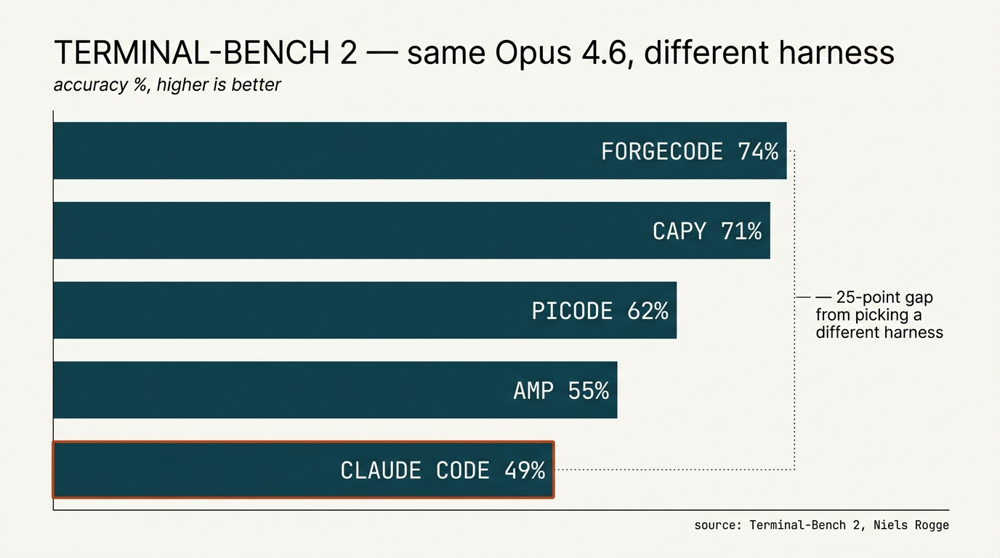

> "Coding agents will build their own tools and their own agents. Agents will be used by non-engineers to manage other agents to manage parts of the org chart."  

I'm on my second Claude Max plan. That's in addition to Cursor, Codex, Gemini, and a healthy Amp habit. *Not to mention a [Jetson AGX Thor](https://www.nvidia.com/en-us/autonomous-machines/embedded-systems/jetson-thor/) I'm about to plug in at the office — more on that one later.*

Overnight jobs parsing financial deal structures, ops stuff, research, monitoring logs, responding to events, all the little background things. The first plan tapped out, I added another, that one tapped out too, and now I'm provisioning a third the way you'd add a build runner. *Mundane.*

## A new entry in an old list

Look at the paragraph I just wrote. *Overnight jobs parsing financial deal structures, ops stuff, research, monitoring logs, responding to events.* Half of those words are themselves names of native units of computing. Logs — log aggregators. Events — event streams. Research — search indexes. Ops — schedulers, orchestrators, deployment systems. Jobs — queues. The lede is already a list of older units I'm wiring into.

Computing has been accreting native units forever, and the way you build the next layer is *by composing the units underneath it.*

You combine adders and accumulators to make a CPU. You combine CPUs and memory and a bus to make a machine. You combine logic gates and clocks to make registers. You combine Boolean functions and a process model to make an operating system. You combine lexers and parsers and code generators to make a compiler. You combine source files and a compiler to make a program. You combine programs and a network stack to make a service. You combine services and a database to make an application. You combine applications and a queue to make a pipeline. You combine pipelines and a stream processor to make a real-time system. You combine streams and a log aggregator to make observability. You combine logs and a metric and an anomaly model to make a monitor. You combine all of it and a scheduler and you have a system that runs without you watching it.

*Each layer is just the layer below, composed.* That's what a native unit is — the thing you stop writing yourself, the thing you wire to. You don't write a compiler. You don't write a Postgres. You don't write a Kafka or a Kubernetes or a Lucene or a git. You pick the unit, you combine it with other units, you build on top.

Now look at that list again. Everything on it is sitting on top of Boolean logic. Silicon, gates, arithmetic, state machines, if/then. *Numbers, types, queries, schedules, indexes — all of it is deterministic logic resolving down to ones and zeros.* You can climb that stack pretty high, but you don't get out of it.

Neural nets aren't more of that. They're a *different kind of logic.* Pattern, association, similarity, fuzzy matching, generation. The thing silicon-and-Boolean was bad at, that we kept failing to solve with cleverer rules, the neural net does natively. We added a new floor — GPUs, TPUs, the Cerebras inference fabric, the Jetson on my desk — and a new kind of computation running on it that doesn't reduce to *if A and B then C*.

By themselves these things predict tokens. They don't loop, they don't read files, they don't remember. To get computation out of one you wrap it. A loop, some tools, file access, a shell, a way to manage context. That wrapper is the **harness**. The harness is the unit that turns "predicts the next token" into "does the work" — and lets the new kind of logic compose with the old kind.

*The neural harness is to neural nets what the compiler was to source code.* New entry on the list, joining the family rather than replacing it. The work I'm running on these two-going-on-three Max plans is mostly the harness wiring into the older units — tailing logs, querying state, watching streams, kicking off jobs, hitting indexes. *New unit, old units, composed.*

That's why the second Max plan isn't weird. The bill scales with how much work you're doing in the new unit. I'm doing a lot of work in the new unit.

## How it shows up in a day

It really has stopped being a tool I reach for; its just the tool.

When I'm coding, I'm in a harness. When I'm reading a PDF I needed to read anyway, the harness is the thing reading it. Operations folder — SOWs, invoices, content ideas, project status — that's a harness. Parsing 20 financial deal docs and writing me a summary while I sleep — harness. *Family infographics, fasting tracker, [oura ring trends](/posts/how-i-use-ai-jan-2026/) — harness, harness, harness.* Different work, same unit.

Coding was just the first place this paid off, because the feedback loop is tightest. Compile or don't, test or don't, the world tells you you're wrong inside a second. So that's where the harness got tuned first. *That's why the unit is called a "coding agent" right now.* But "coding" is vestigial. The thing isn't a coding agent. It's a harness around a model, and what runs in it is whatever you have tools for.

[Rick Blalock](https://www.rickblalock.dev/) said it in AI Engineering Miami — *coding agent as universal software primitive.* A 60-year-old in Texas replaced a $10k/month HubSpot bill by pointing one of these at the problem for three months. A 24-year-old window cleaner in Florida runs marketing, sales, and estimating off the same primitive. Both of them bought MacMinis. Tim Cook didn't have that on his bingo card.

## The model question is below the harness question

Here's something I noticed about my own behavior: *I'm mainly on Claude.* Have been for months. I dip in and out of GPT and Grok and Gemini, but just sort of end up back here.  Not because I reasoned out a model strategy — because Claude Code defaults to it and now I'm on Opus all day every day. Amp has its opinion and I try to set Cursor to super max mode, but really the model picked itself by way of the harness picking it for me.

So the perennial "Opus vs GPT-5 vs Gemini 3" argument is pitched one floor below where the action is. It's not model-vs-model. It's harness-with-default-model vs other-harness-with-default-model. The harness drives the model choice, often without telling you.

And underneath that, there's a whole zoo. Frontier reasoning models. Cheap fast models. Code-specific fine-tunes. Local models that run on the GPU you already own. Cerebras-fast inference at 1,200 tokens/sec, a different regime entirely. *And the inside-the-harness thing*: Tejas Bhakta at Miami called it "everything is models" — a compaction model running every two seconds, a code-search model at 80k tokens/sec, a frontier model doing only the heavy reasoning, all stitched together. *Software 3.5*, he called it. The harness picks all of that for you, or doesn't, depending on which harness.

Which means the harness *is* a model strategy. Picking a harness on purpose means picking which models do which jobs inside it.

## So which harness?

A separate post coming soon — each one deserves its own treatment and the conversation moves week to week. The shape of it:

You can **[build your own](/reports/coding-agent/)** in a weekend. About 50 lines gets you the loop. *Highly recommend, even if you never use it.* **Claude Code** is the one everyone uses, and — by Anthropic's own model on Anthropic's own benchmark — the worst Claude harness on offer. (Niels Rogge posted [Terminal-Bench 2](https://www.tbench.ai/leaderboard): same Opus 4.6, Claude Code last, ForgeCode and Capy at 70-75%. *Twenty-five points of accuracy from picking a different harness.*) **[Picode](https://pi.dev)** is Mario Zechner's minimal, self-modifying one — four tools, the agent writes its own extensions, hot-reloads in the session. The most fun one to play with right now. **[Amp](https://ampcode.com/)** is the one I'm most fascinated with — though to be clear, I'm editing this post in [Cursor](https://cursor.com/). The multimodel thing actually works now. *In [January](/posts/how-i-use-ai-jan-2026/) I wrote that Amp "should be better, but, you know, isn't." Four months later: it is.*

The point of *this* post is the unit, not the catalog.

## What I'm still circling

What's the unit of shipping? Ben Davis's claim in Miami was that it's becoming a directory of skill files plus a coding-agent runtime. *That feels right.* But the runtime is also moving — picode's bet is that it should be malleable inside the session, so you can't pin it. Maybe the unit is even smaller. Maybe the unit is the harness, configured.

What about the Jetson on my desk. The other thing the bill is about to teach us is that *some of this work shouldn't be paying a subscription at all.* Local models on local hardware — gpt-oss, Qwen, MiniMax, whatever's frontier-enough for the job — running on the GPU you already own, or the Jetson, or the laptop. Cheap as electricity. No data leaving the building. The harness doesn't care which model it's calling. The bill cares a lot. I think a real chunk of what's running on the second Max plan ends up local by the end of the year.

When the bill becomes a real line item — and it will — what does that conversation sound like? "Cloud spend" took ten years to become its own column on the financial statement. "Token spend" might take less. We're paying for a unit of computation, not for software. *Different shape entirely.*

I'll get the third Max plan tomorrow. *There's another job.*
